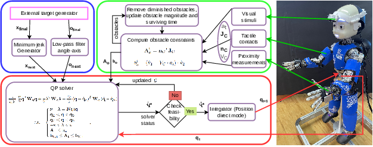

# react-control

[](https://zenhub.com)

This repository contains a controller for the iCub for performing reaching with simultaneous reactive whole-body obstacle avoidance. The module thus encapsulates the functionality of an inverse kinematics solver and the actual controller that generates the commands to reach a position in Cartesian space. The obstacles - perceived visually or through the iCub's sensitive skin - are incorporated on the run as additional constraints.

The reaching controller is standalone in the `reactController` module here, but to acquire the information about the visual/tactile obstacles, it relies on communication with modules from the [peripersonal-space repository](https://github.com/robotology/peripersonal-space).

## Structure of the repository

The core module is the `reactController`.

The old modules and tests which had an internal/development character are placed in `deprecated` folder.

### Documentation of the `reactController`

#### Dependencies:
    yarp
    iKin
    skinDynLib
    ctrlLib
    osqpEigen
    Eigen3

#### Principles of operation:

This modules parallels the functionality of the iCub [Cartesian interface](http://wiki.icub.org/brain/icub_cartesian_interface.html), but both the solver and controller are encapsulated in the single problem formulation. 

The task is formulated as a quadratic program that seeks joint velocity commands respecting multiple constraints while minimizing the magnitude of the velocities. 
The obstacles are dynamically managed by mapping visual and proximity (pre-collision) and tactile (post-collision) obstacles as additional constraints to the motion controller.
The solution to the task (given in the *joint velocity space*) is integrated into new joint positions sent directly to the robot (see the schema below). 
Importantly, there is no distinction between end-effector and whole-body: the obstacles affect every body part in the same way - by limiting the joint velocities.




## Citation
If you found this work useful, please cite our manuscript:

```bibtex
@ARTICLE{rozlivek2024harmonious,
  author={Jakub Rozlivek and Alessandro Roncone and Ugo Pattacini and Matej Hoffmann},
  journal={IEEE Transactions on Robotics}, 
  title={{HARMONIOUS – Human-like reactive motion control and multimodal perception for humanoid robots}}, 
  year={2024},
  volume={?},
  number={?},
  pages={???},
  doi={10.1109/TRO.202}}
```

## Authors

 * [Alessandro Roncone (@alecive)](https://github.com/alecive)
 * [Matej Hoffmann (@matejhof)](https://github.com/matejhof)
 * [Ugo Pattacini (@pattacini)](https://github.com/pattacini)
 * [Jakub Rozlivek (@rozliv)](https://github.com/rozliv)

